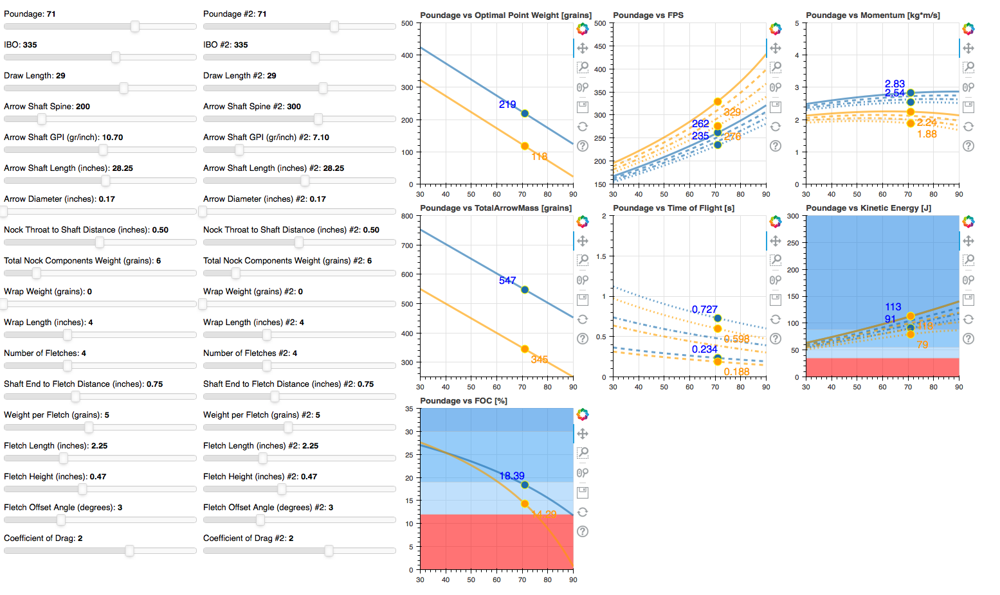

# ArrowCalculator
My semi-scratchpad and visualization dashboard to plan for an arrow set up


# Introduction

This code is meant to explore the relationships between different arrow and bow variables 
such as Arrow Length, Arrow GPI, Arrow Spine, Arrow Component weight, etc. and the Bow Poundage
with one critical assumption/restraint:

That there is an optimal Point Weight for a given Arrow Length, Arrow Spine, Bow Poundage, and Bow IBO,
because an arrow is similar to a mass+spring system and there's a sweet spot between under and over spined
arrow setups. Ideally, this optimal point weight should make it easier to get a bullet hole with bare shaft paper
tuning right from the get go assuming your rest, cams, and D-loop are where they're supposed to be.

The method for determining an Arrow Manufacturer's recommended Spine for a given Bow IBO, Bow Poundage, 
Arrow Length, and Point Weight confusing, much varied between brands, and do not offer a high resolution 
nor intuitively visual interface to explore arrow dynamics.

Although one could make a far underspined or far overspined arrow setup, paper tune to get a bullet hole, 
and still have a successful hunt, I'm more interested in geeking out and providing a tool for fellow archers and hunters.

These values aren't meant to be exact, but it should get you directionally where you want to go, and in
the ballpark.

Not a coder by profession so please excuse the messy code.


# Example and Quick Takeaways

Below is an example where I compare two options for a 200 spine arrow for my PSE Mach 34 with an IBO of 335 FPS, and 71# draw at 29" draw length. Specficifcally a higher FOC (shout out to the Ranch Fairy and Dr. Ashby) and Weight option, the Sirius Orion in Blue, and an ultra fast option, the Victory RIP XV in Orange. Here's some takeaways:

* The Orion has a higher Optimal Point Weight, Total Arrow Mass @ 547gr, and FOC @ 18.39%
* The Orion maintains Speed (FPS), Momentum and Kinetic Energy over distance better
* To venture into the 600-700gr and >20% FOC regime, I'd need to drop down to between a 50-60# draw. This would have marginal impact on momentum, but take around a minus 30-50 fps hit, increase of 30-60ms time to target at 20yd, and dip from the Extreme Game Animal Kinetic Energy terriroty to Large Game Animals.
* The Victory RIP XV, saves about 130ms time to target at 60yd, and starts in the Large Game Animal terriroty at 60yd right off the bat at 70# draw

<p align="center">
  
</p>
### Legend
* Blue - Sirus Orion
* Orange - Victory IP XV
* Solid Line - Nominal or at 0yd distance
* Dashed Line - at 20yd distance
* Dash-Dot Line - at 40 yd distance
* Dotted Line - at 60yd distance

### FOC Color Band Legend (per Ashby Reports https://static1.squarespace.com/static/5d0443b188b6c900011e0ccc/t/5e9378b48f4a085e431232d4/1586722996915/2019+Terminal+Arrow+Performance+Update.pdf)
* Red - Normal FOC <12%
* Light Blue - High FOC 12-19%
* Medium Blue - Extreme FOC 19-30%
* Dark Blue - Ultra Extreme FOC >30%

### Kinetic Energy Color Band Legend
* Red - Small Game - 25ft lbs, <34J
* Light Blue - Medium - Deer 25-41ft lbs, 35-56J
* Medium Blue - Large - Elk 41-65ft lbs,  56-88J
* Dark Blue - Extreme - Moose 65+ft lbs, >88J

# Future Work
* Get this on an actual site so folks don't need to install Python, Jupyter Notebook, and a bunch of libraries to play with it realtime
* Explore Impulse, or the dynamics during impact with animal skin
* Explore penetration with modeling ballistics dynamics through the animal

# Assumptions

From the analysis of various Arrow Spine charts from popular arrow manufacturer's, I've derived the following equation
that calculates the Optimal Point Weight given the Bow IBO, Bow Poundage, Arrow Length, and Arrow Spine

* Nominal Starting Point Weight is 150 grains
* Assume Relationship between Nominal Starting Point Weight and Effective Poundage is 25:5 (From manufacturers)
* IBO to Poundage Slope is 0.252
* IBO to Poundage Intercept is -81.8
* Will also be using a default Drag Coefficient of 2, but feel free to play around with it. Per the whitepaper: Meyer, H.O. (2015) Applications of Physics to Archery https://arxiv.org/pdf/1511.02250.pdf

### Linear Regression parameters derived from various arrow manufacturer spine charts. See below for plots
* aggregateRegValuesSlopeSlope = -0.001
* aggregateRegValuesSlopeIntercept = -0.174
* aggregateRegValuesIntSlope = -3.885
* aggregateRegValuesIntIntercept = 237.637

<p align="center">
  
</p>

# Equations

### Optimal Point Weight [gr]

* calcOpPointWeight = 150+25/5 * (-0.252 * chosenIBO + 81.8 -calcPoundage + 
                    (aggregateRegValuesSlopeSlope*chosenArrowLength 
                    + aggregateRegValuesSlopeIntercept) * chosenSpine 
                    + aggregateRegValuesIntSlope*chosenArrowLength 
                    + aggregateRegValuesIntIntercept)  

### Total Arrow Mass [gr]

* calcTotalArrowMass = chosenNockWeight + chosenArrowWrapWeight + chosenFletchNumber * chosenFletchWeight + chosenArrowGPI * chosenArrowLength + calcOpPointWeight

### FOC [%]

* calcFOC = (100 *((chosenNockWeight * chosenNockThroatAdder + chosenArrowWrapLength * (chosenNockThroatAdder + chosenArrowWrapLength/2) 
            + (chosenFletchNumber * chosenFletchWeight) * (chosenFletchDistanceFromShaftEnd + chosenFletchLength/3) 
            + (chosenArrowGPI * chosenArrowLength) * (chosenNockThroatAdder + chosenArrowLength/2) 
            + calcOpPointWeight * (chosenNockThroatAdder + chosenArrowLength))
            /(calcTotalArrowMass) 
            - (chosenArrowLength + chosenNockThroatAdder)/2))/(chosenArrowLength + chosenNockThroatAdder)     

###  Nominal Kinetic Energy [J]

* calcKENominal = (0.5*((350/15.43)/1000)*((chosenIBO-10*(30-chosenDrawLength)-2*(70-calcPoundage))*0.3048)**2)

### FPS [f/s]

* calcFPS = (((calcKENominal*2)/((calcTotalArrowMass/15.43)/1000))**0.5)/0.3048

### Cross Sectional area of arrow

* area_cross_section = np.pi*((chosenArrowDiam/12)/2)**2 + chosenFletchNumber * 0.5 * chosenFletchLength/12 * chosenFletchHeight/12 * chosenFletchOffset/90  # ft^2

### Velocity at certain distances [fps]

* calcFPS20yd = calculate_speed(calcFPS, area_cross_section, chosenCoefDrag, calcTotalArrowMass/7000, 60)
* calcFPS40yd = calculate_speed(calcFPS, area_cross_section, chosenCoefDrag, calcTotalArrowMass/7000, 120)
* calcFPS60yd = calculate_speed(calcFPS, area_cross_section, chosenCoefDrag, calcTotalArrowMass/7000, 180)

### Time of Flight [s]

* calcTOF20yd = calculate_time(calcFPS, area_cross_section, chosenCoefDrag, calcTotalArrowMass/7000, 60)
* calcTOF40yd = calculate_time(calcFPS, area_cross_section, chosenCoefDrag, calcTotalArrowMass/7000, 120)
* calcTOF60yd = calculate_time(calcFPS, area_cross_section, chosenCoefDrag, calcTotalArrowMass/7000, 180)
  
### Kinetic Energy [J]

* calcKE = 0.5*((calcMPS**2)*((calcTotalArrowMass/15.43)/1000))

### Momentum [kg*m/s]

* calcMomentum = ((calcTotalArrowMass/15.43)/1000)*calcFPS *0.3048

### Calculate Speed
* calculate_speed is a function listed below that iterates over a 1ms time interval and calculates the new velocity after effects from Air Density, Arrow Cross Sectional Area and Drag Coefficient. And determines the velocity at a given distance

```
def calculate_speed(initial_velocity, area_cross_section ,coefficient_drag, arrow_mass, distance):
    '''
    returns an array of different velocities given different initial_velocity
    '''

    # Constants
    air_density = 0.0752  # lb/ft^3
    if isinstance(initial_velocity, float):
        # Calculate the velocity at the given distance
        runtime = 3
        time_of_flight = 0
        distance_traveled = 0
        acceleration = lambda v: -0.5 * air_density * area_cross_section * coefficient_drag * v**2 / arrow_mass
        velocity = initial_velocity
        dt = 0.001  # time step size
        for t in range(int(runtime/dt)):
            velocity += acceleration(velocity) * dt
            time_of_flight = time_of_flight + dt
            distance_traveled = distance_traveled + velocity * dt
            if distance_traveled >= distance:
                break
        
        return velocity
        
    v_list = []
    for i in range(len(initial_velocity)):
        iv = initial_velocity[i]
        # Calculate the velocity at the given distance
        runtime = 3
        time_of_flight = 0
        distance_traveled = 0
        acceleration = lambda v: -0.5 * air_density * area_cross_section * coefficient_drag * v**2 / arrow_mass[i]
        velocity = iv
        dt = 0.001  # time step size
        for t in range(int(runtime/dt)):
            velocity += acceleration(velocity) * dt
            time_of_flight = time_of_flight + dt
            distance_traveled = distance_traveled + velocity * dt
            if distance_traveled >= distance:
                break
        v_list.append(velocity)

    # Return the velocity in feet per second
    return np.array(v_list)
```

### Calculate Time of Flight
* Calculate_time is a function listed below that iterates over a 1ms time interval and calculates the new velocity after effects from Air Density, Arrow Cross Sectional Area and Drag Coefficient. And determines the time of flight to reach a given distance

```
def calculate_time(initial_velocity, area_cross_section ,coefficient_drag, arrow_mass, distance):
    '''
    returns an array of different time of flights given different initial_velocity
    '''
    
    # Constants
    air_density = 0.0752  # lb/ft^3
    if isinstance(initial_velocity, float):
        # Calculate the velocity at the given distance
        runtime = 3
        time_of_flight = 0
        distance_traveled = 0
        acceleration = lambda v: -0.5 * air_density * area_cross_section * coefficient_drag * v**2 / arrow_mass
        velocity = initial_velocity
        dt = 0.001  # time step size
        for t in range(int(runtime/dt)):
            velocity += acceleration(velocity) * dt
            time_of_flight = time_of_flight + dt
            distance_traveled = distance_traveled + velocity * dt
            if distance_traveled >= distance:
                break

        return time_of_flight

    t_list = []
    for i in range(len(initial_velocity)):
        iv = initial_velocity[i]
        # Calculate the velocity at the given distance
        runtime = 3
        time_of_flight = 0
        distance_traveled = 0
        acceleration = lambda v: -0.5 * air_density * area_cross_section * coefficient_drag * v**2 / arrow_mass[i]
        velocity = iv
        dt = 0.001  # time step size
        for t in range(int(runtime/dt)):
            velocity += acceleration(velocity) * dt
            time_of_flight = time_of_flight + dt
            distance_traveled = distance_traveled + velocity * dt
            if distance_traveled >= distance:
                break
        t_list.append(time_of_flight)

    # Return the velocity in feet per second
    return np.array(t_list)
```


